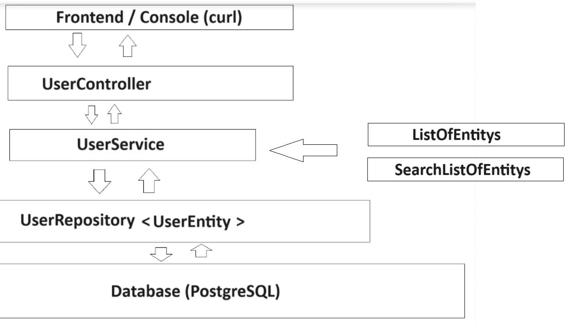

# User-Management (Chat)

#### Teilnehmer:
- Alireza Dehghanazad,
- Gerrit Hoffmann

#### Beschreibung:
Diese Projekt repräsentiert ein einfaches Beispiel für eine User-Management Backend welches Beispielsweise bei einer Chatanwendung zum Einsatz kommt.
Ziel des Projekts ist es, mithilfe von REST-API's, User zu verwalten . Dafür bietet es folgende Funktionen: 

- Nutzer **registrieren**
- Nutzer **anmelden**
- Nutzer **löschen**
- Nutzer(-eigenschaften) **ändern** 
- Nutzer **anzeigen**

FoSe
I-22

---
Verwendete Pakete:
* JPA
* H2 (nur für Tests)
* mySQL (Datenbank)
* Spring Web (Rest API)
* Swagger (bessere Darstellung der Rest Endpunkte)

### api

**{**

**controller**
- UserController.java

**model**
- ListOfEntitys.java
- SearchListOfEntitys.java
- UserEntity.java

**}**

### exceptions
- UserEntityNotFoundException.java
	
### repository
- UserRepository.java

### service
- UserService.java

#### ChatApplication.java

